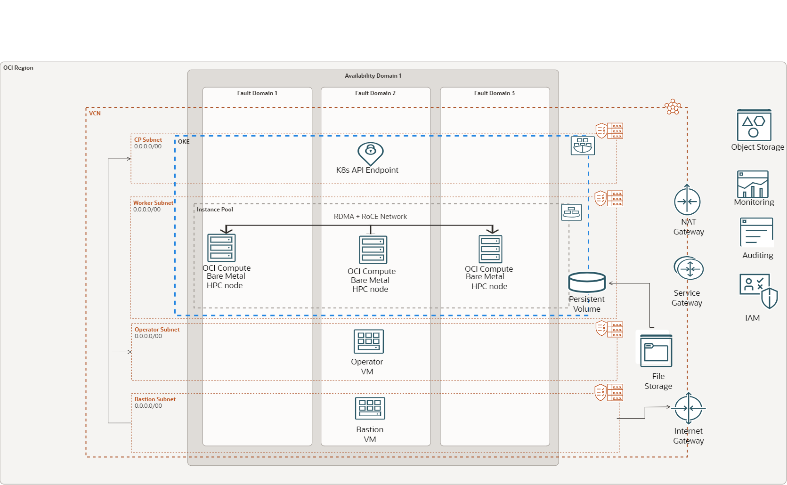

# Deploying a HPC Cluster with RDMA Network on OCI OKE 

## Assumptions

1. The terraform script will be run on  OCI Cloud Shell.
2. The OKE clusters will use private control planes.





## Create the OKE Clusters

1. Copy the terraform.tfvars.example to terraform.tfvars and provide the necessary values as detailed in steps 2-7.

2. Configure the provider parameters:

```
# provider

home_region = "eu-frankfurt-1"

region = "eu-frankfurt"

tenancy_id = "ocid1.tenancy.oc1.."

compartment_id = "ocid1.compartment.oc1.."
```

3. Configure an ssh key pair:

```
# ssh
ssh_private_key_path = "~/.ssh/id_rsa"
ssh_public_key  = "ssh-rsa AAAAB3NzaC1yc2E....."
```


5. Configure variable.ft parameters.<br>
<strong> N/B</strong>:
<ul>
<li>Cluster type must set be "enhanced" and network type to "flannel" for RDMA to work.</li>
<li>Check OCI documentation for supported HPC shapes <a href "https://docs.oracle.com/en-us/iaas/Content/Compute/References/computeshapes.htm#bm-hpc-optimized">here</a> </li>
<li>The HPC pool requires you to use an image provided by the Oracle HPC team, you can find the import <a href https://objectstorage.us-ashburn-1.oraclecloud.com/p/f6mKO0d_OG7gL4EyE5rvOWObL6LBgQ1XXtpM2H67SYmFHQ-tBwxyg7Wmii94VYc8/n/hpc_limited_availability/b/images/o/OracleLinux-8-OCA-RHCK-OFED-5.8-3.0.7.0-GPU-535-OKE-2024.02.12-0>Link</a>. This image includes the OFED drivers and necessary packages configured for RDMA. Import this image to Object storage and create a custom image from it.  </li>

</ul>

```
 variable hpc_image { default = "" } #ocid of the custom image
 variable hpc_shape { default = "" }
 variable kubernetes_version { default = "v1.29.1" }
 variable cluster_type { default = "enhanced" }
 variable cluster_name { default = "oke-rdma-cluster" }
 variable cni_type {default = "flannel"}


```

6. Configure your bastion and operator shapes on main.tf file:

```
bastion_shape = {
  shape            = "VM.Standard.E4.Flex",
  ocpus            = 1,
  memory           = 4,
  boot_volume_size = 50
  }

operator_shape = {
  shape            = "VM.Standard.E4.Flex",
  ocpus            = 1,
  memory           = 4,
  boot_volume_size = 50
  }

```

7. Run terraform to create your clusters:

```
terraform init

terraform plan -var-file="terraform.tfvars"

terraform apply -var-file="terraform.tfvars"

```


## Mount OCI FSS as Persistent Volume

1. The template will deploy a bastion instance and an operator instance. The operator instance will have access to the OKE cluster. You can connect to the operator instance via SSH with

```
ssh_to_operator = "ssh -o ProxyCommand='ssh -W %h:%p -i <path-to-private-key> opc@<bastion_ip>' -i <path-to-private-key> opc@<operator_ip>"
```

2. Verify you can see all nodes in the cluster:

```
kubectl get nodes
```

3. Copy the the hpc-fss-pv.yaml located in the OKE FSS PV folder and edit the following line:

```
volumeHandle to <FileSystemOCID>:<MountTargetIP>:<path>
where:
<ul>
 <li><FileSystemOCID> is the OCID of the file system defined in the File Storage service.</li>
 <li><MountTargetIP> is the IP address assigned to the mount target.</li>
 <li><path> is the mount path to the file system relative to the mount target IP address, starting with a slash.</li>

</ul>

```
4. Create a persistent volume

```
 kubectl create -f hpc-fss-pv.yaml
 kubectl get pv

```

5. Copy and Edit the hpc-fss-pvc.yaml and edit the line:
volumeName: hpc-fss-pv to have the correct name of the Persistent volume 

```
volumeName: <name of Persistent volume>
```

6. Create the peristent volume claim and make sure its bound:

```
 kubectl create -f hpc-fss-pv.yaml

 kubectl get pvc
```

